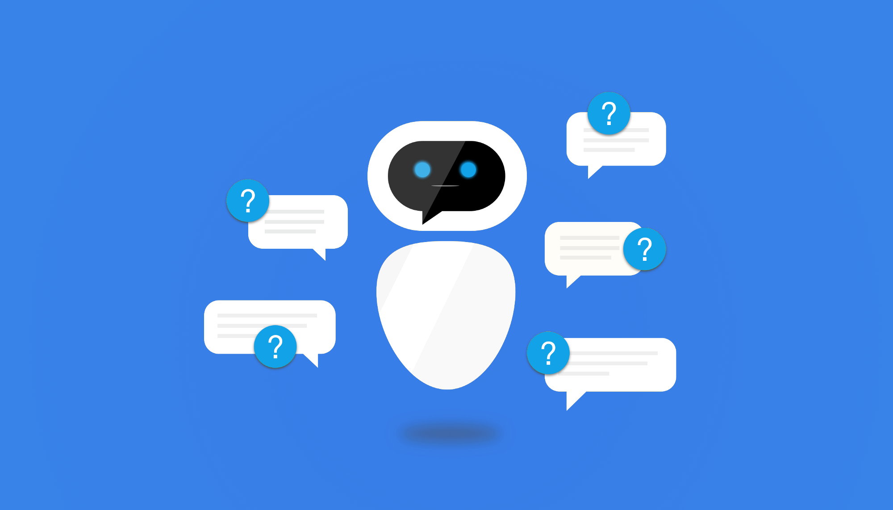

# AI_ChatBotDemo_Python
#Developed By : AnTeater515

AI ChatBot using Python Tensorflow and Natural Language Processing (NLP) along side TFLearn
Want to Learn about ChatBots? So the Solution is Here.

######Components
1- intents.json — abunch of JavaScript objects that lists different tags that correspond to different types of word patterns

2. train_chatbot.py — the code for reading in the natural language data into a training set and using a Keras sequential neural network to create a model

3. words.pkl — a list of different words that could be used for pattern recognition

4. classes.pkl — a list of different types of classes of responses

5- chatbot_model.h5 — the actual model created by train_chatbot.py and used by chatgui.py

6. chatgui.py — the code for cleaning up the responses based on the predictions from the model and creating a graphical interface for interacting with the chatbot

####How to Run
terminal: 'python chatgui.py'

####Dependancies
ChatterBot (pip install chatterbot)
tensorflow (pip install tensorflow)
keras (pip install keras)
pickle (pip install pickle)
nltk (pip install nltk)

LEARN MORE ABOUT CHATBOTS.... Visit - https://www.datacamp.com/community/tutorials/building-a-chatbot-using-chatterbot
1. What are ChatBots?
2. What ChatBots Can Do?
3. Architecture and Working of ChatBots
4. Core Processes of ChatBots
5. Use Cases of ChatBots
6. Comparisons of ChatBot platforms
7. Top Platforms to Build ChatBots and Tools used in ChatBot Development.
8. Practical Work - Build One Contextual ChatBot Using Python, Tensorflow, and NLP.

It's a very Informative Session that discloses about ChatBots and Their Internal Working Architecture along with Programming.

To get the Source Code, Follow me on Github -
Github -https://github.com/AnTeater515

The More You Analyze, More You Get Insights from the Data.
